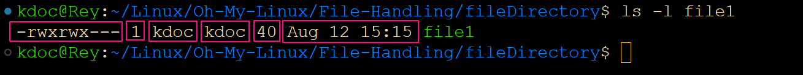

What does the -r/-R flag do?

The -r (or -R in some commands) flag allows you to run a command recursively. For example, listing all the files under a directory structure can be done recursively using ls -R.
Example: To list all the files in /dir1, you can run:
ls -r dir1/

>>kdoc@Rey:~/Linux/Oh-My-Linux/File-Handling$ ls -r dir1/
file4  file3  file2  file1
+++++++++++++++

Explain each field in the output of ls -l command

The ls -l command shows a detailed list of files in a long format. Each field from left to right represents:File permissions, Number of links, Owner name, Owner group, File size, Timestamp of last modification, Directory or file name.
Example:
>>kdoc@Rey:~/Linux/Oh-My-Linux/File-Handling$ ls -l dir1/

++++++++++++++++++++

What are hidden files/directories?

Hidden files or directories are those not displayed after a standard ls listing.
Examples include .bashrc or .KUBECONFIG. They are often used for configuration or scripts.
How to list them? use ls -a
Example:
>> kdoc@Rey:~/Linux/Oh-My-Linux/File-Handling$ ls -a

++++++++++++++++++++++++++++

What do > and < do in terms of input and output for programs?

> redirects output to a file.
< redirects input from a file.
Example:
css

myProgram < input.txt > executionOutput.txt

++++++++++++++++++++++++++++
Explain the following commands:

grep 'Romeo' file1

cut: A tool for cutting out selected portions of each line in a file.
Example: Cut the first two bytes from each line in a file:

cut -b 1-3 file1

awk: A programming language mainly used for text processing and data extraction.
Example: Extract the first field from a CSV file:

awk -F ',' '{print $1}' file.csv

++++++++++++++++++++++++++++
How to rename a file or a directory?

Use the mv command.
Example: mv oldname newname

++++++++++++++++++++++++++++
Specify the command for the following scenarios:
Remove a directory with files:

>>rm -rf dir

++++++++++++++++++++++++++++
Display the content of a file:

>> cat file.txt

++++++++++++++++++++++++++++
Provide access to the file /tmp/MyPrivateFile for everyone with a full access:

>> chmod 777 /tmp/MyPrivateFile    or
>> chmod +xwr /tmp/MyPrivateFile

++++++++++++++++++++++++++++
Replace every occurrence of the word "good" with "great" in the file /tmp/MyPrivateFile:

>> sed -i 's/good/great/g' /tmp/MyPrivateFile

Fix the following commands:

Sed command:

sed 's/1/2/g' /tmp/myFile
Find command:
arduino

find . -iname "*.yaml" -exec sed -i "s/1/2/g" {} \;

++++++++++++++++++++++++++++
How do you schedule tasks periodically?

You can use the cron command to schedule tasks.
Example:
markdown

*/30 * * * *   myscript.sh
Alternatively, you can use systemd timers if your distro supports it.

++++++++++++++++++++++++++++
How can you check the path of a command?

Use  whereis or which commands.
Example:
>> whereis man

++++++++++++++++++++++++++++

How to check which commands you executed in the past?

Use the history command or check the .bash_history file.
